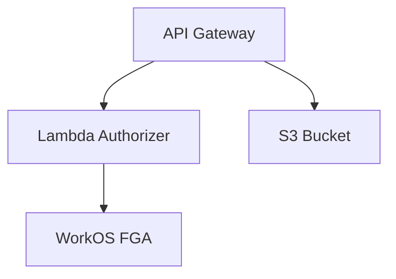

# WorkOS FGA S3 Authorization Demo

A demonstration project showing how to implement fine-grained authorization for AWS S3 using WorkOS FGA and AWS Lambda authorizers. This project deploys a complete serverless infrastructure that showcases secure document access control.

## Overview

This project demonstrates:
- Fine-grained access control for S3 documents using WorkOS FGA
- Serverless API implementation using AWS API Gateway and Lambda
- Infrastructure as Code using AWS CDK
- Secure document storage using S3

The deployed infrastructure includes:
- S3 bucket for document storage
- API Gateway with Lambda authorizer
- WorkOS FGA integration for access control
- Sample documents with different access levels

This can serve as a starting point for implementing document management systems requiring fine-grained access control.

## Architecture



## Prerequisites

- AWS Account with appropriate permissions
- Node.js 18 or later
- AWS CLI configured
- WorkOS account and API key
- CDK CLI (`npm install -g aws-cdk`)
- WorkOS CLI

## Setup

1. **Install and Configure WorkOS CLI**
   ```bash
   # Install using Homebrew
   brew install workos/tap/workos-cli

   # Initialize WorkOS CLI configuration
   workos init
   ```
   Follow the prompts to complete your setup.

2. **Configure WorkOS FGA Schema**
   
   We've created a schema for you in `schema.txt`. This schema defines:
   - User types and team memberships
   - Report access control with owner, editor, and viewer roles
   - Inheritance rules where:
     - Owners automatically get editor permissions
     - Editors automatically get viewer permissions
     - Team members can view reports owned by their team

   Note: Applying a new schema will replace any existing schema. Make sure to backup your current schema if needed.

   Apply the schema to your WorkOS organization:
   ```bash
   workos fga schema apply schema.txt
   ```

3. **AWS IAM Setup**

   Create an IAM user with programmatic access and the following permissions:
   - AWSCloudFormationFullAccess
   - IAMFullAccess
   - AmazonS3FullAccess
   - AmazonAPIGatewayAdministrator
   - AWSLambda_FullAccess

   Configure AWS CLI:
   ```bash
   aws configure
   ```

4. **Clone and Install Dependencies**
   ```bash
   git clone <repository-url>
   cd workos-fga-s3-demo
   npm install
   ```

5. **Environment Configuration**
   ```bash
   export WORKOS_API_KEY=your_api_key_here
   ```

6. **Deploy Infrastructure**
   ```bash
   # Bootstrap CDK (first time only)
   cdk bootstrap

   # Deploy all stacks
   cdk deploy --all
   ```

7. **Run the Demo Script**
   
   We've included a demo script that sets up test users, teams, and reports, then runs through various authorization scenarios to demonstrate the FGA schema in action:

   ```bash
   npm run demo
   ```

   The demo will:
   - Create a team with two members (user1, user2)
   - Set up three reports with different permission configurations
   - Run test cases to verify:
     - Owner permission inheritance (owner → editor → viewer)
     - Editor permission inheritance (editor → viewer)
     - Team-based access controls
     - Permission denials for unauthorized users

## Project Structure

```
.
├── bin/
│   └── app.ts                 # CDK app entry point
├── lib/
│   ├── api-gateway-stack.ts   # API Gateway infrastructure
│   └── s3-stack.ts           # S3 bucket infrastructure
├── src/
│   └── authorizer/
│       └── index.ts          # Lambda authorizer code
├── assets/
│   └── sample-documents/     # Sample documents
├── cdk.json                  # CDK configuration
└── package.json
```

## Usage

### API Endpoints

The deployment creates an API Gateway with the following endpoints:

- `GET /documents/{documentId}`
  - Retrieves a document from S3
  - Requires Authorization header with WorkOS FGA token
  - Access controlled by WorkOS FGA rules

Example request:

```bash
curl -H "Authorization: Bearer ${TOKEN}" \
     https://${API_ID}.execute-api.${REGION}.amazonaws.com/prod/documents/team-doc-1.txt
```

### Security Features

- S3 Bucket Security:
  - Public access blocked
  - Server-side encryption enabled
  - SSL/TLS required
  - Versioning enabled
- API Security:
  - Lambda authorizer validates all requests
  - WorkOS FGA enforces fine-grained permissions
  - IAM roles follow least privilege principle

## Troubleshooting

Common issues and solutions:

1. **CDK Bootstrap Errors**
   ```bash
   # Ensure AWS credentials are configured
   aws configure

   # Re-run bootstrap
   cdk bootstrap
   ```

2. **Deployment Failures**
   - Check CloudWatch logs for Lambda authorizer errors
   - Verify WorkOS API key is set correctly
   - Ensure AWS credentials have sufficient permissions

3. **Authorization Errors**
   - Verify token format in Authorization header
   - Check WorkOS FGA configuration
   - Review CloudWatch logs for authorization failures

## Development

To modify the infrastructure:

1. Make changes to CDK stacks in `lib/`
2. Preview changes:
   ```bash
   cdk diff
   ```
3. Deploy:
   ```bash
   cdk deploy --all
   ```

Available npm scripts:

```bash
npm run build    # Compile TypeScript
npm run watch    # Watch for changes
npm run test     # Run tests
```