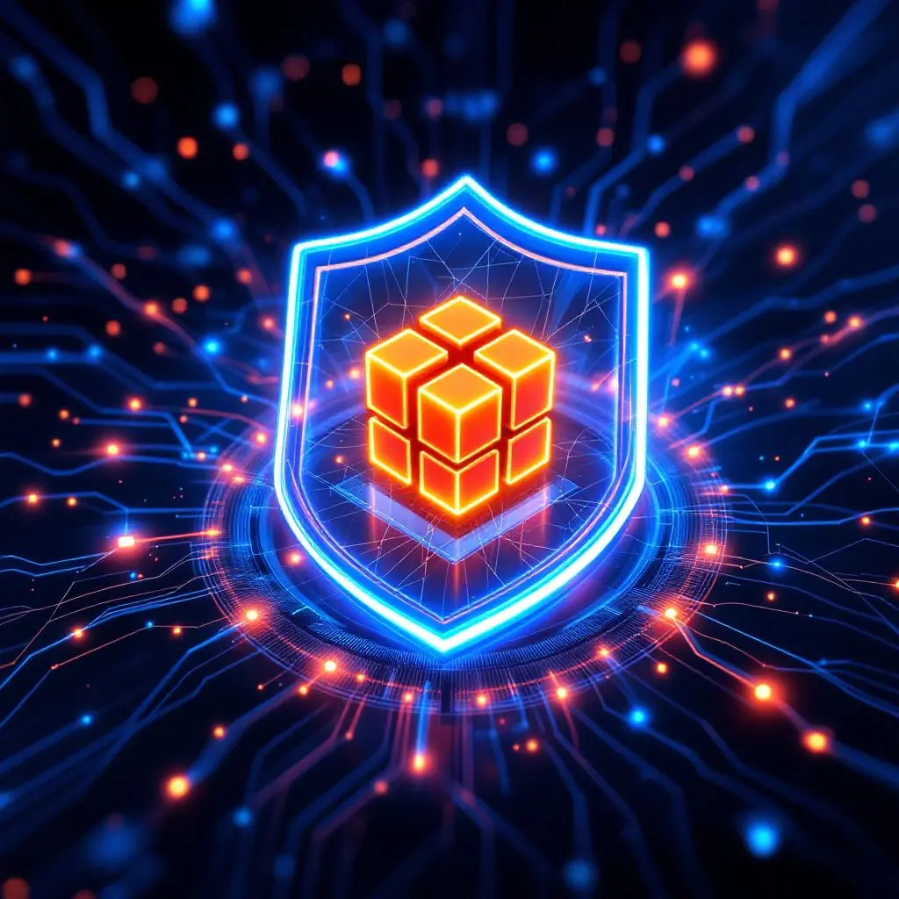

# WorkOS FGA S3 Authorization Demo



A project demonstrating an implementation of fine-grained authorization for AWS S3 using WorkOS FGA and AWS Lambda authorizers. This project deploys serverless infrastructure that showcases secure document access control.

## Overview

This project demonstrates:
- Fine-grained access control for S3 documents using WorkOS FGA
- Serverless API implementation using AWS API Gateway and Lambda
- Infrastructure as Code using AWS CDK

The deployed infrastructure includes:
- S3 bucket containing sample documents with different access levels
- API Gateway with Lambda authorizer
- WorkOS FGA integration for access control

This can serve as a starting point for implementing document management systems requiring fine-grained access control.

## Prerequisites

- AWS Account with appropriate permissions
- Node.js 18 or later
- AWS CLI configured
- [WorkOS account](https://dashboard.workos.com/sign-in) and API key
- CDK CLI (`npm install -g aws-cdk`)
- WorkOS CLI (Recommended)

## Setup

1. **Install and Configure WorkOS CLI**
   ```bash
   # Install using Homebrew
   brew install workos/tap/workos-cli

   # Initialize WorkOS CLI configuration 
   # You will need your WORKOS_API_KEY from https://dashboard.workos.com/get-started
   workos init
   ```
   Follow the prompts to complete your setup.

2. **Clone and Install Dependencies**
   ```bash
   git clone https://github.com/zackproser-workos/aws-lambda-authorizer-fga-cdk 
   cd aws-lambda-authorizer-fga-cdk
   npm install
   ```

3. **Environment Configuration**
   ```bash
   # Copy the example environment file
   cp .env.example .env

   # Edit .env and fill in the required values:
   # - WORKOS_API_KEY=sk_test_xxxxxxxxxxxx
   # - JWT_SECRET=your-secret-key-here
   # - AWS_REGION=us-east-1 (optional)
   # - AWS_PROFILE=default (optional)
   ```

4. **Configure WorkOS FGA Schema**
   
   We've created a schema for you in `schema.txt`. This schema defines:
   - User types and team memberships
   - Report access control with owner, editor, and viewer roles
   - Inheritance rules where:
     - Owners automatically get editor permissions
     - Editors automatically get viewer permissions
     - Team members can view reports owned by their team

   Note: Applying a new schema will replace any existing schema. Make sure to backup your current schema if needed.

   Apply the schema to your WorkOS organization:
   ```bash
   workos fga schema apply schema.txt
   ```

5. **AWS IAM Setup**

   Create an IAM user with programmatic access and the following permissions:
   - AWSCloudFormationFullAccess
   - IAMFullAccess
   - AmazonS3FullAccess
   - AmazonAPIGatewayAdministrator
   - AWSLambda_FullAccess

   Configure AWS CLI:
   ```bash
   aws configure
   ```

6. **Deploy Infrastructure**
   ```bash
   # Bootstrap CDK (first time only)
   cdk bootstrap

   # Deploy all stacks
   cdk deploy --all
   ```

7. **Run the Demo Script**
   ```bash
   npm run demo
   ```
## Demo Output

When you run `npm run demo`, you'll see a comprehensive demonstration of the FGA authorization rules and API access:

```bash
> workos-fga-lambda-s3@1.0.0 demo
> ts-node scripts/demo.ts

📚 WorkOS FGA Demo: Document Access Control

Part 1: Testing FGA Rules Directly

🏗️  Setting up test environment...
├── Creating Engineering team
├── Adding test users:
│   ├── Alice (Engineering team member)
│   ├── Bob (Engineering team member)
│   └── Charlie (No team affiliations)
└── Creating test documents:
    ├── owner-only-doc.txt (owned by Alice)
    └── team-doc-1.txt (shared with Engineering team)
🧪 Testing FGA Authorization Rules:


🔍 Direct FGA Authorization Checks:

   👩 Alice can view her own document: ✅
   👨 Bob can view team document: ✅
   🧑 Charlie cannot view Alice's document: ✅

Part 2: Testing API Access

🏗️  Getting API Gateway URL...

🔑 Testing document access through API:


1️⃣  Owner Access
   Scenario: 👩 Alice accessing her personal document (owner-only-doc.txt)
   Expectation: Access should be granted (Alice is owner)

   ✅ Successfully accessed document
   📄 Document content read from S3: "This is a sample document accessible only by its owner. "


2️⃣  Team Access
   Scenario: 👨 Bob accessing team document (team-doc-1.txt)
   Expectation: Access should be granted (Bob is team member)

   ✅ Successfully accessed document
   📄 Document content read from S3: "This is a sample document accessible by team members. "


3️⃣  Testing Unauthorized Access
   Scenario: 🧑 Charlie attempting to access protected document (owner-only-doc.txt)
   Expectation: 🧑 Charlie should be denied access as he is not authorized

   ✅ Correctly denied access
   🛡️  Error: {"Message":"User is not authorized to access this resource with an explicit deny"}
```


## Project Structure

```
.
├── bin/
│   └── app.ts                 # CDK app entry point
├── lib/
│   ├── api-gateway-stack.ts   # API Gateway infrastructure
│   └── s3-stack.ts           # S3 bucket infrastructure
├── src/
│   └── authorizer/
│       └── index.ts          # Lambda authorizer code
├── assets/
│   └── sample-documents/     # Sample documents
├── cdk.json                  # CDK configuration
└── package.json
```

## How it works 

The deployment creates an API Gateway with the following endpoints:

- `GET /documents/{documentId}`
  - Retrieves a document from S3
  - Requires Authorization header with WorkOS FGA token
  - Access controlled by WorkOS FGA rules

Example request:

```bash
curl -H "Authorization: Bearer ${TOKEN}" \
     https://${API_ID}.execute-api.${REGION}.amazonaws.com/prod/documents/team-doc-1.txt
```

## Development

To modify the infrastructure:

1. Make changes to CDK stacks in `bin/` or `lib/` or `src/`
2. Preview changes:
   ```bash
   cdk diff
   ```
3. Deploy:
   ```bash
   cdk deploy --all
   ```

